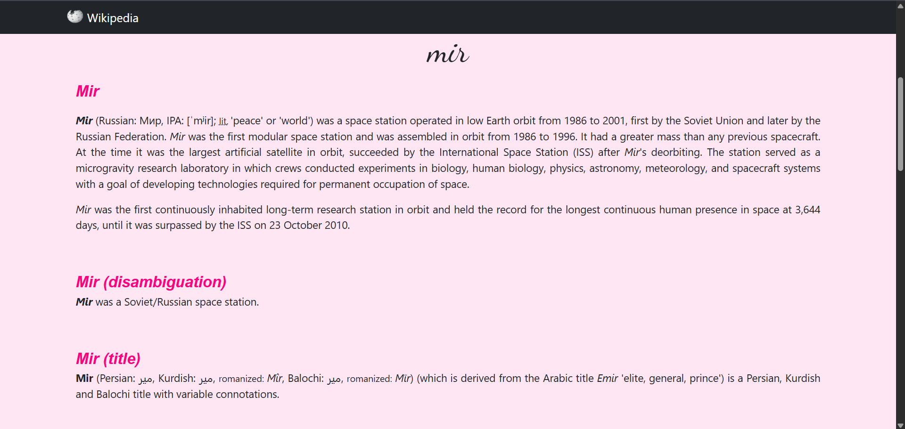
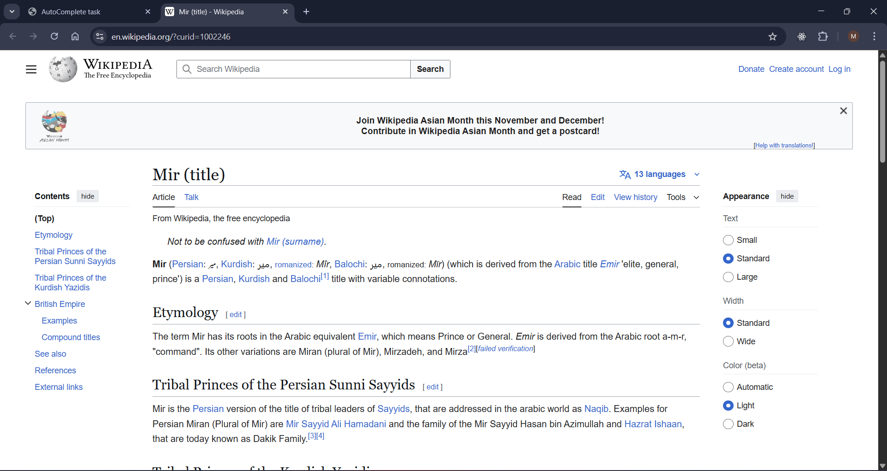

# Wikipedia Autocomplete Search

A simple and elegant **Wikipedia Search App** built with **jQuery, Bootstrap, and the Wikipedia API**.  
It features a smooth **autocomplete search bar** that suggests topics from Wikipedia as you type,  
and displays summaries of matching articles dynamically.


---

##  Features
-  Autocomplete search suggestions powered by the **Wikipedia API**
-  Smooth scroll animation to results
-  Responsive layout using **Bootstrap 5**
-  Custom styling with SCSS variables
-  Clickable article links that open directly on Wikipedia

---

##  Technologies Used
- **HTML5**
- **CSS3 / SCSS**
- **Bootstrap 5**
- **JavaScript (jQuery + jQuery UI)**
- **Wikipedia API**

---

##  How to Run Locally

1. Clone this repository:
   ```bash
   git clone https://github.com/YOUR-USERNAME/AutocompletejQuery.git
   ```
2. Open the folder:
    ```bash
    cd AutocompletejQuery
    ```
3. Open index.html in your browser.

---

##  API Reference

Uses the [Wikipedia API](https://www.mediawiki.org/wiki/API:Main_page):

- `action=opensearch` → for autocomplete suggestions  
- `action=query` → for fetching article summaries

---

## Preview





